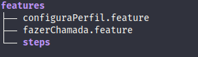

# Especificação Funcionalidades Whatsapp

Proposta de solução para o desafio da concrete solutions,
utilizado no recrutamento de QA's.

## Desafio

* Especificação de duas funcionalidades do Whatsapp (não importa se o app é Android, iOS, Windows Phone ou versão Web) em Gherkin ou Gauge;

* Cada especificação deve conter ao menos um cenário de teste.

## Proposta de Solução

Nesta proposta foi utilizada como referência a versão mobile do app Whatsapp, no sistema operacional Android.

### Setup (Pré configuração) do ambiente

Toda a solução foi desenvolvida no sistema operacional Ubuntu Linux (18.04 LTS).

Foi utilizado o ambiente virtual do Python (venv), para que a instalação de ferramentas adicionais
não afete outras aplicações do sistema. Além disto, todas as dependências estão no arquivo [requirements.txt](requirements.txt).

Para instalar as dependências, utilizando o gerenciador de pacotes do Python (pip)

```console
user@linux:~$ pip install -r requirements.txt
```

### Behave

A ferramenta escolhida para a especificação (Gherkin), foi o [behave](https://behave.readthedocs.io/en/latest/) que utiliza testes escritos em linguagem natural, apoiado por códigos em Python.

Para o funcionamento correto do behave, deve ser respeitada a seguinte estrutura de diretórios



Após a instalação e configuração dos diretórios, basta executar o behave no diretório raiz

```console
user@linux:~$ behave
```

## Autor

[Gustavo Dias A.](https://www.linkedin.com/in/gustavo-dias-alexandre-543568157/)
